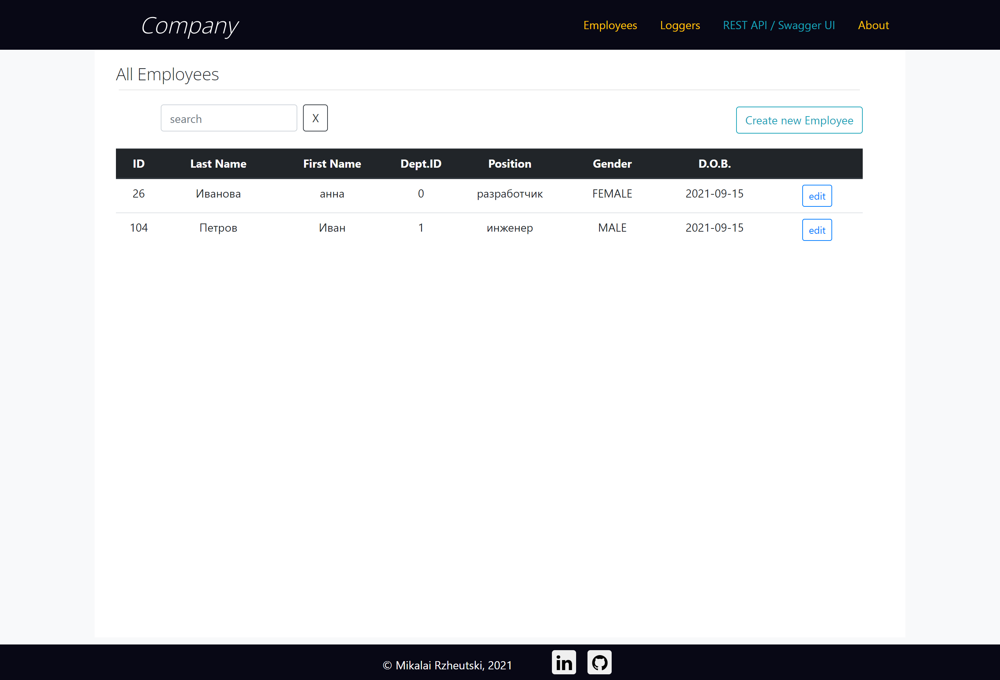
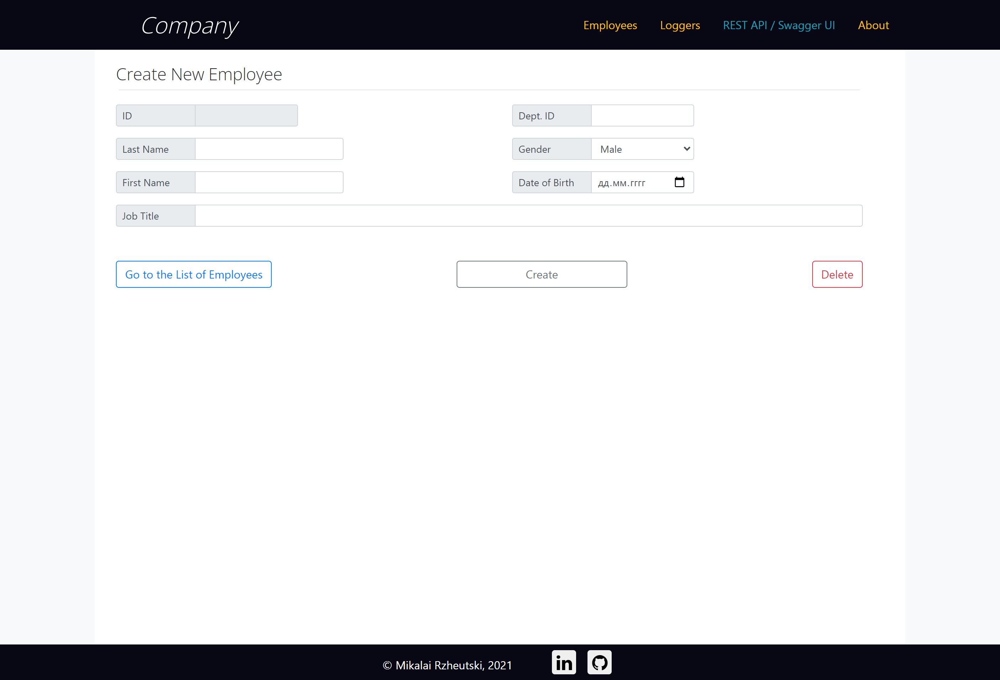
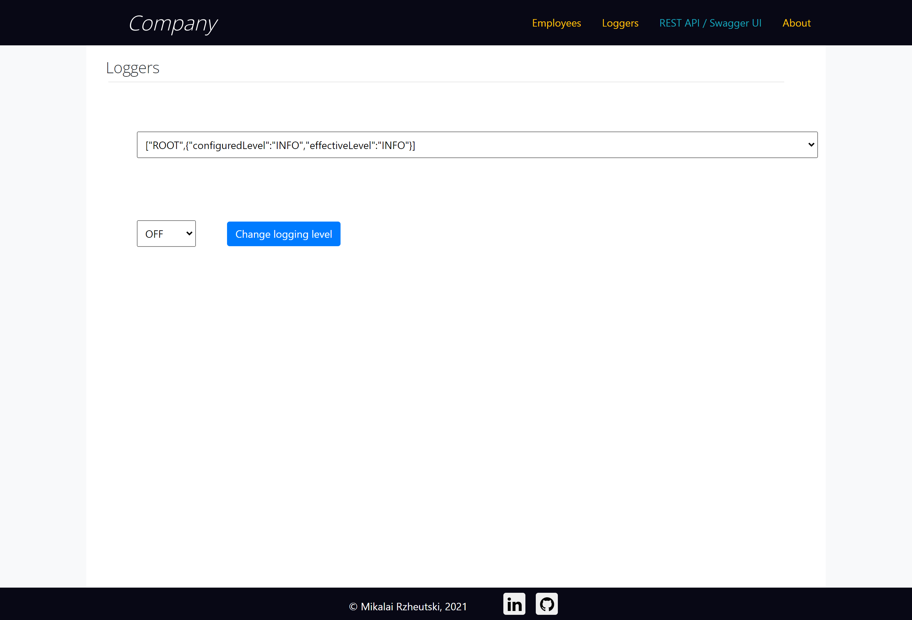

# Employees - Simple Web Application
> PET project (Mikalai Rzheutski)

* [About](#about)
* [How to start](#how-to-start)
* [API](#api)
* [Screenshots](#screenshots)

## About
* Spring Boot, JPA
* Docker, Liquibase
* HTML5, Bootstrap, JS

## How to start  
1. Via docker: just run the ***start.bat*** script in project's folder
2. Without docker:  
    2.1. Set system variables to configure datasource (SPRING_DATASOURCE_PASSWORD, SPRING_DATASOURCE_URL, 
SPRING_DATASOURCE_USERNAME).  
    2.2. Run ***mvn spring-boot:run*** (maven version: 3.3.9)  
    2.3. Go to [http://localhost:8082/employees](http://localhost:8082/employees) 

## API
Swagger API will be available at [http://localhost:8082/swagger-ui.html](http://localhost:8082/swagger-ui.html)

## Screenshots
  
  
  

 

